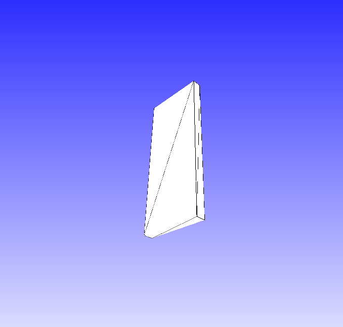

# WebPose

WebPose is a toy program I wrote to learn how to use the [Web Device Orientation API](https://developer.mozilla.org/en-US/docs/Web/API/Detecting_device_orientation).

## How it works

Both a desktop and a phone connect to a Python webserver, each is served its own JavaScript app. The phone app ensures it has a proper connection with the server, then relays its `alpha`, `beta`, and `gamma` sensor values to the server via a websocket. On recipt of a pose packet from the phone, the server transforms the phone's pose from degrees to radians, and re-broadcasts the new packet to the desktop app. The desktop app then spawns a [THREE.js](https://threejs.org/) viewport, and shows the phone's pose graphically via a 3D object on screen.

## Usage

To use this app: clone this repo, then run:

```sh
# Install dependancies
python3 -m pip install -r requirements.txt

# Run the server
python3 server.py
```

Once the server is running, go to the computer's IP address on port `5000` on both a computer and a phone, and select the appropriate options on the webpage for each device. Both devices will show "connecting" messages, then connect to eachother.

## Screenshots



*The desktop app view of my phone's pose*